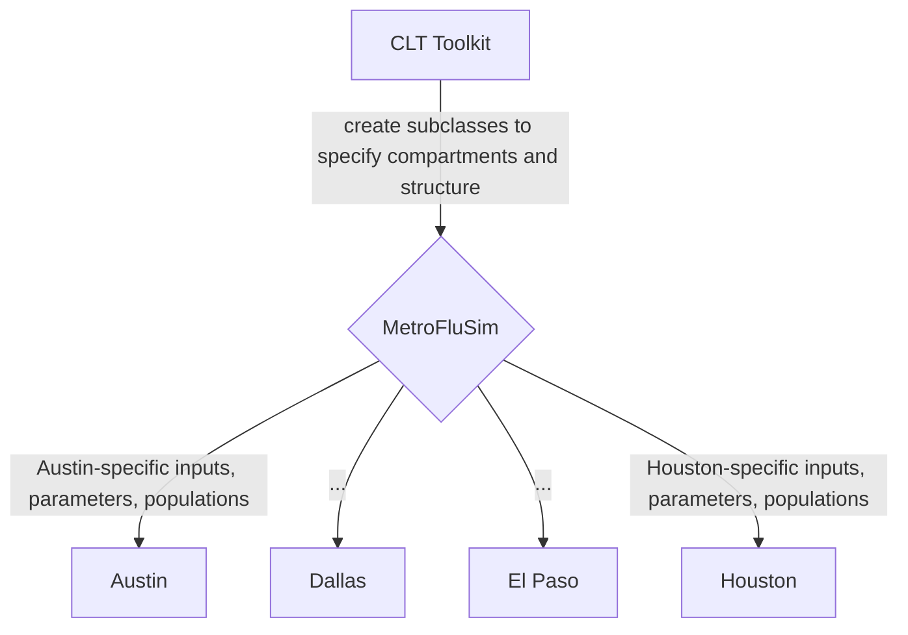

# Overview

This website provides code documentation, including tutorials and API references, for the CLT Toolkit. In addition, this website provides code and mathematical formulation documentation for [MetroFluSim](math_flu_components.md).

The CLT Toolkit is a modular Python codebase for scalable compartmental models of respiratory virus transmission in a city. This effort is spearheaded by the [Meyers Lab](http://www.bio.utexas.edu/research/meyers/) and [epiENGAGE center](https://epiengage.org/) under a [CDC-funded effort](https://www.cdc.gov/insight-net/php/implementers/index.html) to provide high quality technical tools for modeling. This toolkit takes care of fundamental simulation mechanics, allowing users to efficiently build and adapt multiple stochastic models without reimplementing common operations from scratch. This toolkit streamlines the construction of granular metapopulation models -- heterogenous regions can be easily modeled as distinct locations or subpopulations with age and risk groups, all integrated within a single metapopulation framework. 

The toolkit is used to create [MetroFluSim](math_flu_components.md), a high fidelity city-level influenza model that captures population-level immunity dynamics. The Meyers Lab at UT Austin is working directly with public health officials in the Texas cities of Austin, Dallas, El Paso, and Houston to create specific implementations of the `MetroFluSim` model tailored to each city.



## Installation

The CLT Toolkit is written in Python 3.11.0.

To download, build, and run the latest code release, run the following in Terminal:
```
git clone https://github.com/LP-relaxation/CLT_BaseModel.git
```

In the package folder (`pyproject.toml` should be in this directory), run the following in Terminal:
```
pip install -e .
```
to install the package in editable mode. Note that some users may have to use `pip3 install -e .`, depending on their configuration.


Packages required:
```
numpy==1.24.3
pandas==1.5.3
pytest==8.3.3
pytorch==2.3.1
sciris==3.2.0
```

## Quick Start

We recommend 

- `flu_instances/examples/flu_demo.ipynb` for a Jupyter notebook tutorial on building subpopulation and metapopulation models, running random parameter sampling, and organizing large-scale output in experiments.
- `flu_instances/examples/torch_calibration_demo.ipynb` for a Jupyter notebook tutorial on using `pytorch` autodifferentiate to solve least-squares on a deterministic functional implementation of the flu model to calibrate unknown parameters.
- `SIHR_core/SIHR_components.py` for a thoroughly commented file explaining how to use the CLT Toolkit to create a customized model. 

## Code Structure

| Folder               | Description |
|----------------------------------------|-------------|
| `clt_toolkit` | CLT Toolkit abstract "base" classes. These provide reusable functionality for compartmental models, so users can run models without reimplementing simulation logic from scratch. |
| `flu_core` | Subclasses of `clt_base` that designate the compartments and structure of [MetroFluSim](math_flu_components.md), without specifying concrete inputs, parameters, or populations. |
| `flu_instances` | Stores data that specifies concrete inputs, parameters, and populations used to construct particular instances of `MetroFluSim` models (i.e. for particular cities). Contains scripts to simulate and calibrate these instances. |
| `SIHR_core` | Subclasses of `clt_base` that designate the compartments and structure of a simple S-I-H-R model, without specifying concrete inputs, parameters, or populations. Used as a tutorial example. |
| `SIHR_instances` &nbsp;&nbsp;&nbsp;&nbsp;&nbsp;&nbsp;&nbsp;&nbsp; | Stores data that specifies concrete inputs, parameters, and populations used to construct particular instances of the demo SIHR model in `SIHR_core`. |
| `tests` | "If builders built buildings the way programmers wrote programs, then the first woodpecker that came along would destroy civilization." -- [Gerald Weinberg](https://thectoclub.com/software-development/software-testing-quotes/) |

### Toolkit Structure

| Folder        | File          | Description                   |
|---------------|--------------|--------------------------------|
| `clt_toolkit/`  &nbsp;&nbsp;&nbsp;&nbsp;&nbsp;&nbsp;&nbsp;&nbsp; | `base_components`    | Base classes for fundamental simulation objects, such as subpopulation models, metapopulation models, compartments, and transition variables that manage flow between compartments.  |
|               | `base_data_structures` &nbsp;&nbsp;&nbsp;&nbsp;&nbsp;&nbsp;&nbsp;&nbsp;&nbsp;&nbsp;&nbsp;&nbsp;&nbsp;&nbsp;&nbsp;&nbsp;&nbsp;&nbsp;&nbsp;&nbsp;&nbsp;&nbsp;&nbsp;&nbsp;   | Base dataclasses for storing compartment population values, epidemiological parameters, and simulation settings. |
|               | `experiments`    | Tools for running many simulation replications of a model and managing the output. Can handle random sampling of parameters. |
|               | `input_parsers`    | Helper functions for streamlining input reading and validation. 
| | `plotting`    | Plotting functions. |
|               | `utils`    | Utility functions for convenience. |

### Flu Core Structure

Subclasses for MetroFluSim.

| Folder        | File          | Description                   |
|---------------|--------------|--------------------------------|
| `flu_core/`  | `flu_components`    | Subclasses of `clt_base` that define the compartments and corresponding logic of [MetroFluSim](math_flu_components.md). |
|               | `flu_data_structures` &nbsp;&nbsp;&nbsp;&nbsp;&nbsp;&nbsp;&nbsp;&nbsp; | Subclasses of dataclasses in `base_data_structures` that specify the exact fields (compartments, parameters, etc...) needed for MetroFluSim. |
|               | `flu_torch_det_components`    | Deterministic, functional (non-object oriented) version of MetroFluSim that is autodifferentiable with PyTorch and optimized for performance.|
|               | `flu_travel_functions`    | Computes exposure intensity due to local transmission within a subpopulation as well as travel between subpopulations. |

### Flu Model Instances Structure

Code for specific instances of the MetroFluSim model (e.g. for a specific city, with specific inputs, parameters, and populations).  

| Folder        | Folder          | Description                   |
|---------------|--------------|--------------------------------|
| `flu_instances/` &nbsp;&nbsp;&nbsp;&nbsp;&nbsp;&nbsp;  | `calibration_research_input_files/`  &nbsp;&nbsp;&nbsp;&nbsp;&nbsp;&nbsp;&nbsp;&nbsp;&nbsp;&nbsp;&nbsp;&nbsp;&nbsp;&nbsp;&nbsp;&nbsp;&nbsp;&nbsp;&nbsp;&nbsp;&nbsp;&nbsp;&nbsp;&nbsp;&nbsp;&nbsp;&nbsp;&nbsp;&nbsp; | Input files for synthetic flu model instances used to evaluate calibration methods. |
|               | `derived_inputs_computations/`     | Computations generating derived inputs (e.g. age-specific contact matrices). |
|               | `examples/`    | Demo scripts showcasing CLT Toolkit and MetroFluSim functionality, including guides for calibration via optimization with automatic differentiation. |
|               | `texas_flu_hosp_rate_20232024/`    | Publicly available Texas hospitalization data from 2023-2024 flu season. |
|               | `texas_input_files/`    | Most up-to-date parameter values, derived from recent literature or within-host modeling. |

> Updated 08/14/2025. Toolkit and documentation are created by Linda Pei ("LP"), with feedback from Rémy Pasco, Susan Ptak, Emily Javan, and other Meyers Lab members, and with supervision from Dave Morton and Lauren Meyers. Special thanks to Cary Murray for generous guidance on software engineering design. Special credit to Shuotao "Sonny" Diao for his ideas about updating compartments analogously to pushing flow on a graph and creating simulation logic that works for arbitrarily many compartments and transition variables. 