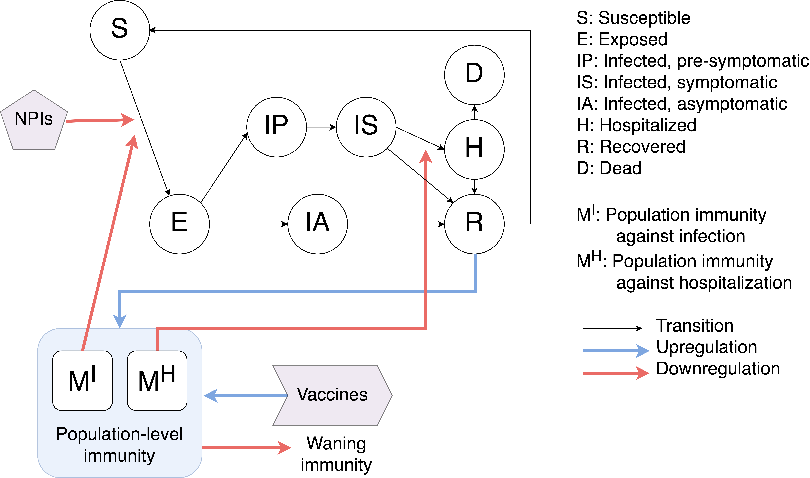

# Flu Model Mathematical Formulation

> **_Written by LP, updated 12/10/2024 (work in progress)_** 

## Flu model: diagram

## Flu model: deterministic differential equations
- $t \in \mathbb N$: current simulation day
- $a$: age group, $A$: set of all age groups
- $\ell$: risk group, $L$: set of all risk groups
- $i$: type of immunity-inducing event, $\mathcal{I} := \left\{\text{H1}, \text{H3}, \text{V}\right\}$: the set of all types of immunity-inducing events: infection by H1N1, infection by H3N2, and vaccination, respectively.
- $\boldsymbol{O}$: $\lvert A \rvert \times \lvert L \rvert \times \lvert \mathcal{I} \rvert$ matrix, where the $(a, \ell, i)$th element is the positive constant modeling the saturation of antibody production in individuals in age group $a$ and risk group $\ell$ who had immunity-inducing event $i$.

**Population-level immunity against _infection_ (derived from H1N1 infections, H3N2 infections, and vaccinations respectively)**

\begin{align}
\frac{dM^I_{a,\ell,H1}(t)}{dt} &= \frac{g^I_{H1} p_{H1}(t) \eta(t) R_{a,\ell}(t)}{N_{a,\ell} \left(1 + \sum_{i \in \mathcal I} O_{a,\ell, i} M^I_{a,\ell, i}(t)\right)} - w^I_{H1} M^I_{a,\ell,H1}(t) \\
\frac{dM^I_{a,\ell,H3}(t)}{dt} &= \frac{g^I_{H3} p_{H3}(t) \eta(t) R_{a,\ell}(t)}{N_{a,\ell} \left(1 + \sum_{i \in \mathcal I} O_{a,\ell, i} M^I_{a,\ell, i}(t)\right)} - w^I_{H3} M^I_{a,\ell,H3}(t) \\
\frac{dM^I_{a,\ell,V}(t)}{dt} &= g^I_V V(t - \delta) - w^I_V M^I_{a,\ell,V}(t)
\end{align}

where

- $\eta$: rate at which recovered individuals become susceptible, so that $1/\eta$ is the average number of days a person is totally immune from reinfection until being susceptible again.
- $g^I_{H1}$: factor by which population-level immunity against infection grows after each H1N1 case that recovers.
- $g^I_{H3}$: factor by which population-level immunity against infection grows after each H3N2 case that recovers.
- $g^I_V$: factor by which population-level immunity against infection grows after each vaccination.
- $\boldsymbol{N}$: $\lvert A \rvert \times \lvert L \rvert$ matrix corresponding to total population, where element $N_{a, \ell}$ is the total population of age group $a$ and risk group $\ell$.
- $\boldsymbol{p} = \boldsymbol{p}(t) = [p_{H1}(t)$, $p_{H3}(t)]$: where elements correspond to prevalence of H1N1, H3N2 respectively.
- $w^I_{H1}$: rate at which H1N1 infection-induced immunity against infection wanes.
- $w^I_{H3}$: rate at which H3N2 infection-induced immunity against infection wanes.
- $w^I_V$: rate at which vaccine-induced immunity against infection wanes.
- $V(t)$: number of vaccine doses administered at time $t$.
- $\delta$: number of days after dose for vaccine to become effective.

**Population-level immunity against _hospitalization_ (derived from H1N1 infections, H3N2 infections, and vaccinations respectively)**

\begin{align}
\frac{dM^H_{a,\ell,H1}(t)}{dt} &= \frac{g^H_{H1} p_{H1}(t) \eta(t) R_{a,\ell}(t)}{N_{a,\ell} \left(1 + \sum_{i \in \mathcal{I}} O_{a,\ell, i} M^H_{a,\ell, i}(t)\right)} - w^H_{H1} M^H_{a,\ell,H1}(t) \\
\frac{dM^H_{a,\ell,H3}(t)}{dt} &= \frac{g^H_{H3} p_{H3}(t) \eta(t) R_{a,\ell}(t)}{N_{a,\ell} \left(1 + \sum_{i \in \mathcal{I}} O_{a,\ell, i} M^H_{a,\ell, i}(t)\right)} - w^H_{H3} M^H_{a,\ell,H3}(t) \\
\frac{dM^H_{a,\ell,V}(t)}{dt} &= g^H_V V(t) - w^H_V M^H_{a,\ell,V}(t)
\end{align}

where

- $p_{H1}(t)$, $p_{H3}(t)$, $V(t)$, $\delta$: see above.
- $g^H_{H1}$: factor by which population-level immunity against hospitalization grows after each H1N1 case that recovers.
- $g^H_{H3}$: factor by which population-level immunity against hospitalization grows after each H3N2 case that recovers.
- $g^H_V$: factor by which population-level immunity against hospitalization grows after each vaccination.
- $w^H_{H1}$: rate at which H1N1 infection-induced immunity against hospitalization wanes.
- $w^H_{H3}$: rate at which H3N2 infection-induced immunity against hospitalization wanes.
- $w^H_V$: rate at which vaccine-induced immunity against hospitalization wanes.

**Compartment equations**

\begin{align}
\frac{dS_{a,\ell}(t)}{dt} &= \underbrace{\eta R_{a,\ell}(t)}_{\text{$R$ to $S$}} -\underbrace{S_{a,\ell}(t) \sum_{a^\prime \in A, \ell^\prime \in L} \frac{\beta(t) \phi_{a, \ell, a^\prime, \ell^\prime}(t) I^{\text{weighted}}_{a^\prime, \ell^\prime}(t)}{N_{a^\prime, \ell^\prime} (1 + \boldsymbol{\Lambda^{I, I}_{a,\ell}(t)})}}_{\text{$S$ to $E$}} \\[1em]
\frac{dE_{a,\ell}(t)}{dt} &= \underbrace{S_{a,\ell}(t) \sum_{a^\prime \in A, \ell^\prime \in L} \frac{\beta(t) \phi_{a, \ell, a^\prime, \ell^\prime}(t) I^{\text{weighted}}_{a^\prime, \ell^\prime}(t)}{N_{a^\prime, \ell^\prime} (1 + \boldsymbol{\Lambda^{I, I}_{a,\ell}(t)})}}_{\text{$S$ to $E$}} - \underbrace{\sigma (1-\tau) E_{a,\ell}(t)}_{\text{$E$ to $I^P$}} - \underbrace{\sigma \tau E_{a,\ell}(t)}_{\text{$E$ to $I^A$}} \\[1em]
\frac{dI^P_{a,\ell}(t)}{dt} &= \underbrace{\sigma (1-\tau) E_{a,\ell}(t)}_{\text{$E$ to $I^P$}} - \underbrace{\rho I^P_{a,\ell}(t)}_{\text{$I^P$ to $I^S$}} \\[1em]
\frac{dI^S_{a,\ell}(t)}{dt} &= \underbrace{\rho I^P_{a,\ell}(t)}_{\text{$I^P$ to $I^S$}} - \underbrace{(1-\tilde{\mu}_{a,\ell})\gamma I^S_{a,\ell}(t)}_{\text{$I^S$ to $R$}} - \underbrace{\frac{\zeta \tilde{\mu}_{a,\ell} I^S_{a,\ell}(t)}{1 + \boldsymbol{\Lambda^{H, H}_{a,\ell}(t)}}}_{\text{$I^S$ to $H$}} \\[1em]
\frac{dI^A_{a,\ell}(t)}{dt} &= \underbrace{\sigma \tau E_{a,\ell}(t)}_{\text{$E$ to $I^A$}} - \underbrace{\gamma_{IA} I^A_{a,\ell}(t)}_{\text{$I^A$ to $R$}} \\[1em]
\frac{dH_{a,\ell}(t)}{dt} &= \underbrace{\frac{\zeta \tilde{\mu}_{a,\ell} I^S_{a,\ell}(t)}{1 + \boldsymbol{\Lambda^{H, H}_{a,\ell}(t)}}}_{\text{$I^S$ to $H$}} - \underbrace{(1-\tilde{\nu}_{a,\ell})\gamma_H H_{a,\ell}(t)}_{\text{$H$ to $R$}} - \underbrace{\frac{\pi \tilde{\nu}_{a,\ell} H_{a,\ell}(t)}{1 + \boldsymbol{\Lambda^{H, H}_{a,\ell}(t)}}}_{\text{$H$ to $D$}} \\[1em]
\frac{dR_{a,\ell}(t)}{dt} &= \underbrace{(1-\tilde{\mu}_{a,\ell}) \gamma I^S_{a,\ell}(t)}_{\text{$I^S$ to $R$}} + \underbrace{\gamma_{IA} I^A_{a,\ell}(t)}_{\text{$I^A$ to $R$}} + \underbrace{(1-\tilde{\nu}_{a,\ell})\gamma_H H_{a,\ell}(t)}_{\text{$H$ to $R$}} - \underbrace{\eta R_{a,\ell}(t)}_{\text{$R$ to $S$}} \\[1em]
\frac{dD_{a,\ell}(t)}{dt} &= \underbrace{\frac{\pi \tilde{\nu}_{a,\ell} H_{a,\ell}(t)}{1 + \boldsymbol{\Lambda^{D, H}}_{a,\ell}(t)}}_{\text{$H$ to $D$}} 
\end{align}

where 

$$
I^{\text{weighted}}_{a^\prime, \ell^\prime}(t) := \left[I^S_{a^\prime, \ell^\prime}(t) + r_{IP} I^P_{a^\prime, \ell^\prime}(t) + r_{IA} I^A_{a^\prime, \ell^\prime}(t)\right]
$$

and where we have the following terms that characterize the effect of population-level immunities:

\begin{align}
\boldsymbol{\Lambda^{I, I}_{a,\ell}(t)} &= \left[\boldsymbol{K_{a,\ell}^I}(p(t))\right]^T \boldsymbol{M_{a,\ell}^I}(t) \\
\boldsymbol{\Lambda^{H, H}_{a,\ell}(t)} &= \left[\boldsymbol{K_{a,\ell}^H}(p(t))\right]^T \boldsymbol{M_{a,\ell}^H}(t) \\
\boldsymbol{\Lambda^{D, H}}_{a,\ell}(t) &= \left[\boldsymbol{K_{a,\ell}^D}(p(t))\right]^T\boldsymbol{M_{a,\ell}^H}(t)
\end{align}

and where

- $\beta(t) = \beta_0 (1 + q(t))$: time-dependent transmission rate per day.
- $q(t)$: seasonality parameter based on absolute humidity, where $q(t)$ is a function of historical absolute humidity data times $\xi$, a humidity impact factor
- $\phi_{a, \ell, a^\prime, \ell^\prime}(t)$: mixing rates between age-risk group $a, \ell$ and $a^\prime, \ell^\prime$. Specifically, the interpretation is: for an individual in age-risk group $a, \ell$, the number of contacts they have in age-risk group $a^\prime, \ell^\prime$ per day.
- $\tau$: proportion exposed who are completely asymptomatic when infectious.
- $r_{IP}$, $r_{IA}$: relative infectiousness (compared to infected symptomatic people) of infected presymptomatic and infected asymptomatic people respectively. 
- $\gamma, \gamma_H, \gamma_{IA}$: recovery rates for infected symptomatic ($I^S$),  hospital ($H$), and infected asymptomatic ($I^A$) compartments respectively, so that $1/\gamma$ is the average number of days it takes for an infected person not in the hospital to recover, and $1/\gamma_H$ is analogous, but for an infected person in the hospital. 
- $\sigma$: infection rate (both exposed to infected presymptomatic transition rate and exposed to infected asymptomatic transition rate), so that $1/\sigma$ is the average number of days after exposure before a person becomes infectious.
- $\rho$: infected presymptomatic to infected symptomatic transition rate, so that $1/rho$ is the average number of days that an infected person is presymptomatic before becoming symptomatic. 
- $\boldsymbol{\tilde{\mu}}$, where $\tilde{\mu}_{a, \ell} = \frac{\mu_{a, \ell}\gamma}{\zeta - \mu_{a, \ell}(\zeta-\gamma)}$: adjusted hospitalization rate (as in, proportion hospitalized based on age-risk group $a, \ell$ group) actually used in model -- this adjustment is necessary to ensure actual proportion hospitalized recapitulates $[\mu_{a, \ell}]$.
- $\boldsymbol{\mu}$: $\lvert A \rvert \times \lvert L \rvert$ hospitalization rate (proportion hospitalized based on age-risk group $a, \ell$).
- $\zeta$: hospitalization rate (infected to hospital transition rate), so that $1/\zeta$ is the average number of days a person is infected before going to the hospital.
- $\boldsymbol{\tilde{\nu}}$, where $\tilde{\nu}_{a, \ell} = \frac{\nu_{a, \ell}\gamma_H}{\pi - \nu_{a, \ell}(\zeta-\gamma_H)}$: adjusted in-hospital mortality rate (as in, proportion who die in the hospital based on age group) actually used in model -- this adjustment is necessary to ensure actual proportion who die in the hospital recapitulates $[\nu_{a, \ell}]$.
- $\boldsymbol{\nu}$: $\lvert A \rvert \times \lvert L \rvert$ in-hospital mortality rate (proportion who die based on age-risk group $a, \ell$).
- $\pi$: death rate from hospital, so that $1/\pi$ is the average number of days a person spends in the hospital before dying.

The following are all $\lvert A \rvert \times \lvert L \rvert \times \lvert \mathcal I \rvert$ matrices:

- **$\boldsymbol{K}^I(\boldsymbol{p}) = [\boldsymbol{K}^I_{H1}(p_{H1}), \boldsymbol{K}^I_{H3}(p_{H3}), \boldsymbol{K}^I_{V}]$**: reduction in infection risk from given immunity-inducing event.  
- **$\boldsymbol{K}^{H}(\boldsymbol{p}) = [\boldsymbol{K}^H_{H1}(p_{H1}), \boldsymbol{K}^H_{H3}(p_{H3}), \boldsymbol{K}^H_{V}]$**: reduction in hospitalization risk from given immunity-inducing event.  
- **$\boldsymbol{K}^D(\boldsymbol{p}) = [\boldsymbol{K}^D_{H1}(p_{H1}), \boldsymbol{K^D}_{H3}(p_{H3}), \boldsymbol{K}^D_{V}]$**: reduction in death risk from given immunity-inducing event.  
- **$\boldsymbol{M}^I = \boldsymbol{M}^I(t) = [\boldsymbol{M}^I_{H1}(t), \boldsymbol{M}^I_{H3}(t), \boldsymbol{M}^I_{V}(t)]$**: population-level immunity from infection (induced by H1 infection, H3 infection, vaccination respectively).  
- **$\boldsymbol{M}^H = \boldsymbol{M}^H(t) = [\boldsymbol{M}^H_{H1}(t), \boldsymbol{M}^H_{H3}(t), \boldsymbol{M}^H_{V}(t)]$**: population-level immunity from hospitalization (induced by H1 infection, H3 infection, vaccination respectively).

Note that prevalence is time-dependent, but we use $\boldsymbol{p} = \boldsymbol{p}(t)$ for notation simplicity. 

## Flu model: discretized stochastic implementation

To actually implement/simulate this compartmental model, we discretize the deterministic differential equations and treat transitions between compartments as stochastic to model uncertainty. We extend the notation from the deterministic differential equations to capture the stochastic elements.

Let **$\boldsymbol{\mathcal X}(t) = \left\{\boldsymbol{S}(t), \boldsymbol{E}(t), \boldsymbol{I}(t), \boldsymbol{H}(t), \boldsymbol{R}(t), \boldsymbol{D}(t), \boldsymbol{M}^I(t), \boldsymbol{M}^H(t), q(t), \boldsymbol{\phi}(t), \boldsymbol{p}(t), V(t)\right\}$** be the "simulate state" at time $t$. **$\boldsymbol{\mathcal X}(t)$** is a set of matrices. 

Let **$\boldsymbol{\Theta} = \left\{\boldsymbol{O}, \boldsymbol{N}, \boldsymbol{g}^I, \boldsymbol{w}^I, \boldsymbol{g}^H, \boldsymbol{w^H}, \beta_0, \gamma, \gamma_H, \sigma, \boldsymbol{\mu}, \zeta, \boldsymbol{\nu}, \pi, \eta \right\}$** be the set of fixed parameters. We define notation $\boldsymbol{g}^I = [g^I_{H1}, g^I_{H3}, g^I_V]$,  $\boldsymbol{w}^I = [w^I_{H1}, w^I_{H3}, w^I_V]$, $\boldsymbol{g}^H = [g^H_{H1}, g^H_{H3}, g^H_V]$, and $\boldsymbol{w}^H = [w^H_{H1}, w^H_{H3}, w^H_V]$. 

Then given initial state $\boldsymbol{\mathcal X}_0 = \boldsymbol{\mathcal X}(0)$, we can formulate our discretized stochastic implementation as

$$
\boldsymbol{\mathcal X}(t + \Delta t) = \boldsymbol{\mathcal X}(t) + f\left(\boldsymbol{\mathcal X}(t), \Delta t, \omega; \boldsymbol{\Theta}\right) \quad \text{for} \quad t \ge 0,
$$

where $f$ is parametrized by $\boldsymbol{\Theta}$, and depends on the step size of discretization $\Delta t$ and a sample path $\omega$. We assume that each sample path $\omega$ is realized from a random process that does not depend on $\boldsymbol{\mathcal X}(t)$ or $\Delta t$ for each $t$. When we are discussing a single model with a fixed set of parameters $\boldsymbol{\Theta}$, we drop the $\boldsymbol{\Theta}$ notation for simplicity.  

Now we formulate how we implement discretized stochastic transitions. We assume that $q(t)$, **$\boldsymbol{\phi}(t)$**, **$\boldsymbol{p}(t)$**, and $V(t)$  are updated deterministically according to some "schedule."  

We model stochastic transitions between compartments using "transition variables." Transition variables correspond to incoming and outgoing flows of epidemiological compartments (see the compartment equations above). 

Below we formulate the discretized stochastic transitions. For brevity, we omit the update formulas for $\boldsymbol{M}^H(t)$ since it is analogous to the discretized update for $\boldsymbol{M}^I(t)$. Note that the population-level immunity variables behave as aggregate epidemiological metrics. They are deterministic functions of the simulation state and transitions between compartments.

> **_Note: all $y$ and $y^*$-variables depend on $\left(\boldsymbol{\mathcal X}(t), \Delta t, \omega\right)$. For notation simplicity, we define $\boldsymbol{\Xi}_t := \left(\boldsymbol{\mathcal X}(t), \Delta t, \omega\right)$ and write $y$ and $y^*$-variables as functions of $\boldsymbol{\Xi}_t$._**

\begin{align}
M_{a, \ell, H1}^I(t + \Delta t) &= M_{a, \ell, H1}^I(t) + \left[\frac{g^I_{H1} p_{H1}(t) \cdot \overbrace{y_{R\rightarrow S,  a, \ell}(\boldsymbol{\Xi}_t)}^{\text{$R$ to $S$}}}{N_{a,\ell} \left(1 + \sum_{i \in \mathcal I} O_{a,\ell, i} M^I_{a,\ell, i}(t)\right)} - w^I_{H1} M^I_{a,\ell,H1}(t)\right] \Delta t \\
M_{a, \ell, H3}^I(t + \Delta t) &= M_{a, \ell, H3}^I(t) + \left[\frac{g^I_{H3} p_{H3}(t) \cdot \overbrace{y_{R\rightarrow S,  a, \ell}(\boldsymbol{\Xi}_t)}^{\text{$R$ to $S$}}}{N_{a,\ell} \left(1 + \sum_{i \in \mathcal I} O_{a,\ell, i} M^I_{a,\ell, i}(t)\right)} - w^I_{H3} M^I_{a,\ell,H3}(t)\right] \Delta t \\
dM^I_{a,\ell,V}(t + \Delta t) &= dM^I_{a,\ell,V}(t) + \left[g^I_V V(t - \delta) - w^I_V M^I_{a,\ell,V}(t)\right] \Delta t
\end{align}

$$
\vdots
$$

\begin{align}
S_{a,\ell}(t + \Delta t) &= S_{a, \ell}(t) + \underbrace{y_{R\rightarrow S, a, \ell}(\boldsymbol{\Xi}_t)}_{\text{$R$ to $S$}} - \underbrace{y_{S\rightarrow E,  a, \ell}(\boldsymbol{\Xi}_t)}_{\text{$S$ to $E$}} \\
E_{a,\ell}(t + \Delta t) &= E_{a, \ell}(t) + \underbrace{y_{S\rightarrow E,  a, \ell}(\boldsymbol{\Xi}_t)}_{\text{$S$ to $E$}} - \underbrace{y^*_{E\rightarrow I^P,  a, \ell}(\boldsymbol{\Xi}_t)}_{\text{$E$ to $I^P$}} - \underbrace{y^*_{E\rightarrow I^A,  a, \ell}(\boldsymbol{\Xi}_t)}_{\text{$E$ to $I^A$}} \\
I^P_{a,\ell}(t + \Delta t) &= I^P_{a,\ell}(t) + \underbrace{y^*_{E\rightarrow I^P,  a, \ell}(\boldsymbol{\Xi}_t)}_{\text{$E$ to $I^P$}} - \underbrace{y_{I^P \rightarrow I^S,  a, \ell}(\boldsymbol{\Xi}_t)}_{\text{$I^P$ to $I^S$}} \\
I^A_{a, \ell}(t + \Delta t) &= I^A_{a, \ell}(t) + \underbrace{y^*_{E\rightarrow I^A,  a, \ell}(\boldsymbol{\Xi}_t)}_{\text{$E$ to $I^A$}} - \underbrace{y_{I^A \rightarrow R,  a, \ell}(\boldsymbol{\Xi}_t)}_{\text{$I^A$ to $R$}} \\
I^S_{a,\ell}(t + \Delta t) &= I^S_{a, \ell}(t) + \underbrace{y_{E \rightarrow I^S,  a, \ell}(\boldsymbol{\Xi}_t)}_{\text{$E$ to $I^P$}} - \underbrace{y^*_{I^S \rightarrow R,  a, \ell}(\boldsymbol{\Xi}_t)}_{\text{$I^S$ to $R$}} - \underbrace{y^*_{I^S \rightarrow H,  a, \ell}(\boldsymbol{\Xi}_t)}_{\text{$I^S$ to $H$}} \\
H_{a,\ell}(t + \Delta t) &= H_{a, \ell}(t) + \underbrace{y^*_{I^S \rightarrow H,  a, \ell}(\boldsymbol{\Xi}_t)}_{\text{$I^S$ to $H$}} - \underbrace{y^*_{H\rightarrow R,  a, \ell}(\boldsymbol{\Xi}_t)}_{\text{$H$ to $R$}} - \underbrace{y^*_{H\rightarrow D,  a, \ell}(\boldsymbol{\Xi}_t)}_{\text{$H$ to $D$}} \\
R_{a,\ell}(t + \Delta t) &= R_{a, \ell}(t) + \underbrace{y^*_{I^S \rightarrow R,  a, \ell}(\boldsymbol{\Xi}_t)}_{\text{$I^S$ to $R$}} + \underbrace{y^*_{H\rightarrow R,  a, \ell}(\boldsymbol{\Xi}_t)}_{\text{$H$ to $R$}} - \underbrace{y_{R\rightarrow S,  a, \ell}(\boldsymbol{\Xi}_t)}_{\text{$R$ to $S$}} \\
D_{a,\ell}(t + \Delta t) &= D_{a, \ell}(t) + \underbrace{y_{H\rightarrow D,  a, \ell}(\boldsymbol{\Xi}_t)}_{\text{$H$ to $D$}} 
\end{align}

IMPORTANT: the "$*$" superscript indicates that the transition variable has a joint distribution with another transition variable. In general, if a compartment has more than one outgoing transition variable, these transition variables must be modeled jointly. 

Consider the two transitions out of the infected symptomatic compartment, for example. Given that a patient is infected and symptomatic, exactly one outcome occurs: they recover (from home) or they go to the hospital. Since one and only one of these outcomes must occur, we must model these two transition variables jointly. Joint distribution derivation details are provided in the next section on transition types.

Each transition variable depends on a "base count" and a "rate" (which both depend on the current state of the system). This decomposition is displayed in the table below.

|             Name            |                                    Transition variable                                   | Base count |                                                                        Rate                                                                       |
|:---------------------------:|:----------------------------------------------------------------------------------------:|:---------------------------------------------------------:|:------------------------------------------------------------------------------------------------------------------------------------------------------------------------------------------------:|
| $R$ to $S$             | $y_{R \rightarrow S, a, \ell}(\boldsymbol{\Xi}_t)$  | $R_{a, \ell}(t)$                                          | $\eta$                                                                                                                                                                                           |
| $S$ to $E$                | $y_{S \rightarrow E, a, \ell}(\boldsymbol{\Xi}_t)$  | $S_{a, \ell}(t)$                                          | $\sum_{a^\prime \in A, \ell^\prime \in L} \frac{\beta(t) \phi_{a, \ell, a^\prime, \ell^\prime}(t)  I^{\text{weighted}}_{a^\prime, \ell^\prime}(t)}{N_{a^\prime, \ell^\prime} (1 + \boldsymbol{\Lambda^{I, I}_{a,\ell}(t)})}$ |
| $E$ to $I^P$                | $y^*_{E \rightarrow I^P, a, \ell}(\boldsymbol{\Xi}_t)$  | $E_{a, \ell}(t)$                                          | $\sigma (1 - \tau)$                                                                                                                                                                                         |
| $E$ to $I^A$                | $y^*_{E \rightarrow I^A, a, \ell}(\boldsymbol{\Xi}_t)$  | $E_{a, \ell}(t)$                                          | $\sigma \tau$ |
| $I^P$ to $I^S$                | $y_{IP  \rightarrow I^S, a, \ell}(\boldsymbol{\Xi}_t)$  | $I^P_{a, \ell}(t)$                                          | $\rho$ |
| $I^S$ to $R$   | $y^*_{I^S \rightarrow R, a, \ell}(\boldsymbol{\Xi}_t)$  | $I^S_{a, \ell}(t)$                                          | $(1-\tilde{\mu}_{a,\ell})\gamma$                                                                                                                                                                 |
| $I^S$ to $H$            | $y^*_{I^S \rightarrow H, a, \ell}(\boldsymbol{\Xi}_t)$  | $I^S_{a, \ell}(t)$                                          | $\frac{\zeta \tilde{\mu}_{a,\ell} I^S_{a,\ell}(t)}{1 + \boldsymbol{\Lambda^{H, H}_{a,\ell}(t)}}$                                                                                                            |
| $I^A$ to $R$            | $y_{I^A \rightarrow R, a, \ell}(\boldsymbol{\Xi}_t)$  | $I^A_{a, \ell}(t)$                                          | $\gamma_{IA} I^A_{a,\ell}(t)$ |
| $H$ to $R$ | $y^*_{H \rightarrow R, a, \ell}(\boldsymbol{\Xi}_t)$  | $H_{a, \ell}(t)$                                          | $(1-\tilde{\nu}_{a,\ell})\gamma_H$                                                                                                                                                 |
| $H$ to $D$                    | $y^*_{H \rightarrow D, a, \ell}(\boldsymbol{\Xi}_t)$  | $H_{a, \ell}(t)$                                          | $\frac{\pi \tilde{\nu}_{a,\ell} H_{a,\ell}(t)}{1 + \boldsymbol{\Lambda^{H, H}_{a,\ell}(t)}}$                                                                                                              |

The base count and rate of a transition variable parameterize the distribution that defines its realization. 

See [this page](math_transitions.md) for mathematical formulations of marginal and joint stochastic transitions between compartments. 

## General model: discretized stochastic implementation

We make the important note that the flu model's discretized stochastic implementation can be generalized to models with different structures. More broadly, we let $\boldsymbol{\mathcal C}(t)$ be a model's set of epidemiological compartments, $\boldsymbol{\mathcal M}(t)$ its set of aggregate epidemiological metrics, and $\boldsymbol{S (t)}$ its set of schedule-dependent (time-dependent) deterministic values. Then the above formulation still holds.

In fact, in our code, we model $\boldsymbol{\mathcal C(t)}$ using an `EpiCompartment` class, $\boldsymbol{\mathcal M}(t)$ using an `EpiMetric` class, and $\boldsymbol{\mathcal S(t)}$ using a `Schedule` class. We handle stochastic transitions using `TransitionVariable` and `TransitionVariableGroup` classes. These classes form some of the building blocks of the base model code. 